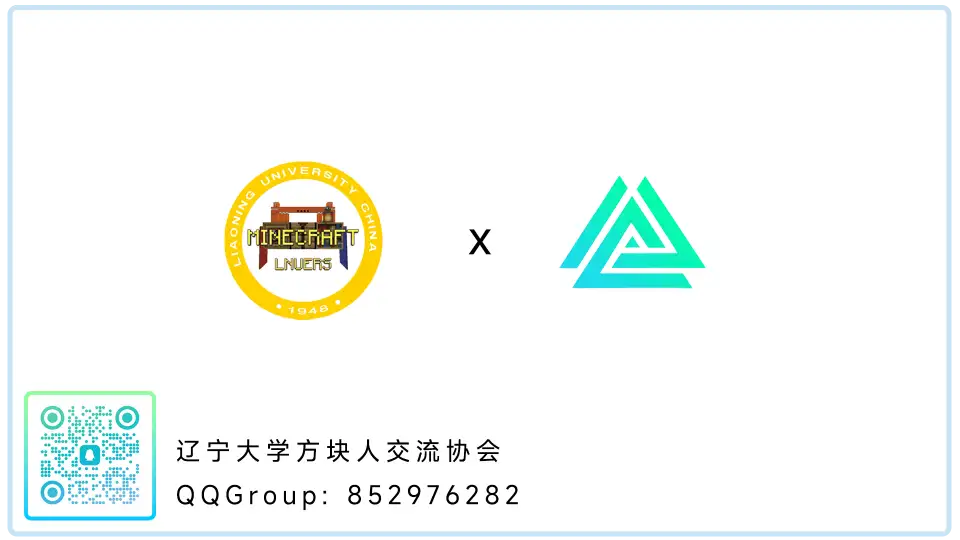
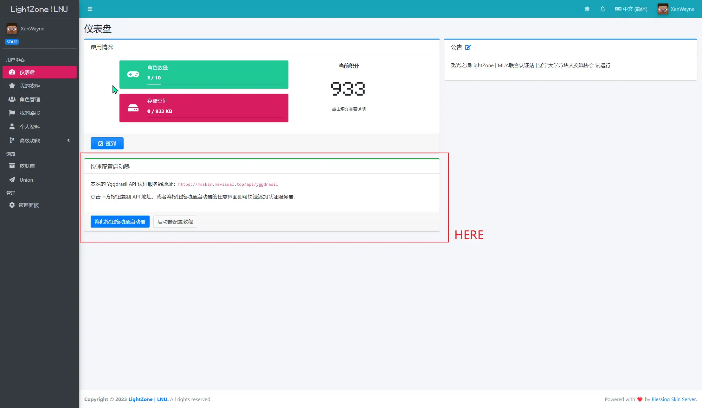
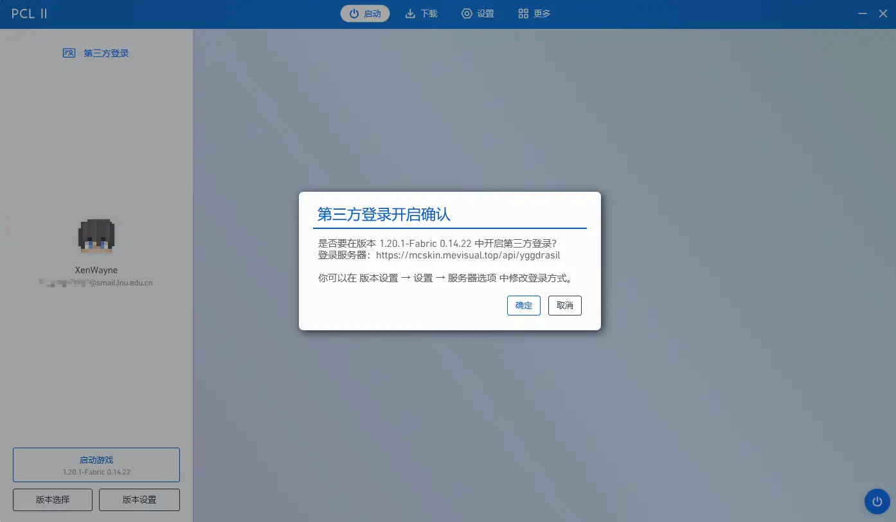

# 快速开始指南

LightZone的账户系统，抑或是Minecraft游戏本身或许有些令人困惑。本指南旨在为新玩家提供一个简洁明了的以最快速度登入LightZone的方式。该文档所提到的信息具有时效性，可能随着架构更新而改变，还请知悉。

## 前言

**如果你是一名经验丰富的Minecraft玩家，熟知版本、Mod、启动器、第三方登录相关知识，那或许简短的文档更加适合你。**

> 详见[MUA Docs](https://docs.mualliance.cn/zh/dev/union/lobby)，"如何访问联合大厅"部分。进入联合大厅后使用`/hub LNUMC`即可登入LightZone。

- - -

LightZoneWiki 并不是针对 《Minecraft》 游戏本身的指南和知识库，如果希望获得关于 Minecraft 游戏本身的信息，请访问：

*   [中文 Minecraft Wiki](https://minecraft-zh.gamepedia.com/)
  - 中国大陆可访问此[镜像站](https://wiki.biligame.com/mc)
*   [英文 Minecraft Wiki](http://minecraft.gamepedia.com/Minecraft_Wiki)

如果这是你第一次玩 Minecraft，请首先参考官方 Wiki 的新手指南：

*   [新手手册](https://wiki.biligame.com/mc/%E6%95%99%E7%A8%8B/%E8%8F%9C%E9%B8%9F%E6%89%8B%E5%86%8C)

以下文档建立在默认您具有Minecraft多人游戏经验，且了解相关知识的基础上编写。  
如果你加入游戏，则默认你同意[玩家守则](wiki/rules.md)
- - -

## 1.加入玩家群组

**这并不是必要的。**但不做隐形人可以更好的融合社区，如果你只是一个游客，请忽视此项。
* 加入[辽宁大学Minecraft同好者协会 QQGroup:`852976282`](https://qm.qq.com/cgi-bin/qm/qr?_wv=1027&k=ZPfzlTX2aMqN_Ty1J5zYUJWjo_IHRc-M&authKey=ZndmENRvqmnGOaOS9DfW3qDnx85lSBGINmxZgfPEpzvme22BZ7wkBdZWDktSDRfs&noverify=0&group_code=852976282)
<!--  -->

- - -

## 2.注册皮肤站账号

LightZone使用MUA联合认证，要登录LightZone，你至少需要一个[MUA User Center](https://skin.mualliance.ltd/)或接入MUA账号系统的[数个皮肤站](https://docs.mualliance.cn/zh/dev/union/lobby)中的一个账户。

- - -
对于本站，向你推荐如下选择:
>[MUA User Center](//skin.mualliance.ltd) <sub>(优先选择)</sub>  

注册要求和流程详见其注册页面说明。

- - -

>[LNU | LightZone皮肤站](//mcskin.mevisual.top)  

LightZone自建的皮肤站，同样接入MUA。为社区一致性考虑，目前采用邀请码制度。  
你可通过以下渠道申请到邀请码:  
Ⅰ.加入上述的[辽宁大学Minecraft同好者协会](https://qm.qq.com/cgi-bin/qm/qr?_wv=1027&k=ZPfzlTX2aMqN_Ty1J5zYUJWjo_IHRc-M&authKey=ZndmENRvqmnGOaOS9DfW3qDnx85lSBGINmxZgfPEpzvme22BZ7wkBdZWDktSDRfs&noverify=0&group_code=852976282)，联系`@森稳XenWayne`或`@相思故/对江邀月`。  

Ⅱ.邮件至xenwayne@mevisual.top  
内容模板应至少包括:  
```
你的Minecraft ID(如有，优先与正版ID一致):  
你从何处理解到LightZone:
[可选]证明你辽宁大学学生身份的材料(包括但不限于学生证、学信网、录取通知书等，不必包含个人隐私信息)：
```
!>获得邀请码后请尽快注册，在注册完成皮肤站后，请确保你通过了**邮件认证**(你将在个人仪表盘看到相关提示，部分未有此设置的皮肤站除外)，并**至少拥有一个角色**，完成一切工作后，你也可在此上传皮肤，一切就像使用LittleSkin那样。

- - -

## 3.准备客户端
**如果你熟练使用启动器下载、配置游戏，请跳过这部分。**  
LightZone的主要节点是纯净服务器，请确保本地已有对应版本的客户端。客户端侧Mod可随意，影响游戏平衡的除外。如果你对于Minecraft客户端的Mod构成不了解或不善于研究客户端本身，欢迎访问[【推荐资源】](wiki/resources.md)页面。

- - -

## 4.配置启动器第三方登录

!>由于各启动器的UI设计不尽相同，这里仅介绍快速配置方法，在大多数情况下该方法可用。如果你的环境快速配置不可用，请查阅对应启动器相关文档或利用搜索引擎。

>手动配置参考 [Blessing Skin用户手册](https://blessing.netlify.app/yggdrasil-api/authlib-injector.html)

打开你的皮肤站仪表盘，你将会看到**快速配置启动器**模块:  
<!--  -->

将该按钮用鼠标拖拽至**启动器的主页面**松开，启动器应会弹出相关提示，通常这个过程是一键完成的，这里以PCL2的界面为例:
<!--  -->


>相关视频教程:  
[【Minecraft服务器】雕刻时光老建筑服务器外置登录教程](https://www.bilibili.com/video/BV18X4y1x7Pp/?share_source=copy_web&vd_source=7a6cb213a314151b2df861c13e2bc2d3)<sup>HMCL</sup>  
[【NSF】PCL2启动器外置登录方案](https://www.bilibili.com/video/BV15Y411j7B7/)<sup>PCL</sup>  

~~碎碎念:真有人用官启么= =~~
- - -

## 5.添加多人服务器
恭喜你，在使用第三方登录启动游戏后，此时你已经可以添加并加入服务器。  
在多人游戏中添加服务器时，你有以下方式可选择:  

1.`lnu.lightzone.mevisual.top`<sup>LNUMC_MUA上海交通大学接入点</sup>  
通过此域名加入，你将直接加入LightZone中，同时也可使用MUA联合大厅的全部功能，使用`/hub`指令在各大高校服务器中畅行。本服的唯一标识是`LNUMC`。  

<small>注：我们已经注意到了北方地区在该节点的延迟略高问题，总体上目前阶段不影响游戏体验，待商讨。</small> 

2.`lobby.mualliance.cn`<sup>MUA联合大厅_MUA上海交通大学接入点</sup>  
通过此域名加入，你将加入到MUA联合大厅的登录服中，使用`/hub`指令在各大高校服务器中畅行。此时使用指令`/hub LNUMC`即可加入LightZone。  

3.`ipv6.lightzone.mevisual.top`<sup>LNUMC_MUA上海交通大学接入点</sup>  

!>此节点为低延迟需求设计，仅支持IPv6连接，请确认你处于IPv6网络环境下。(蜂窝网络通常都支持IPv6连接)。  

通过此域名加入，你将直接加入LightZone中，**但不可使用MUA联合大厅的相关功能**，`/hub`在此**不可用**。 

## 6.HelloWorld!

如果一切正常，你将在短暂的加载世界提示后看到一个水光接天的世界，你的出生点在神樱树下，至此，本快速指南的任务完成。接下来，引导的工作将交给你周围的文字提示，开始你的探索吧。


## 在那之后...

当你第一次登录服务器时，可能有欢迎你的玩家，有人帮助你上手游戏，亦或是这里空无一人，无论如何，都希望你在这里的旅程愉快。这里不设经济系统，我们希望这里有『大同社会』般的社区体验，这意味着每个人都应做到:尊重社区成果，遵守[玩家守则](wiki/rules.md)。出生点保护区域不允许建造和破坏，你将在出入出生点保护边界时在聊天框收到来自系统的通知。
